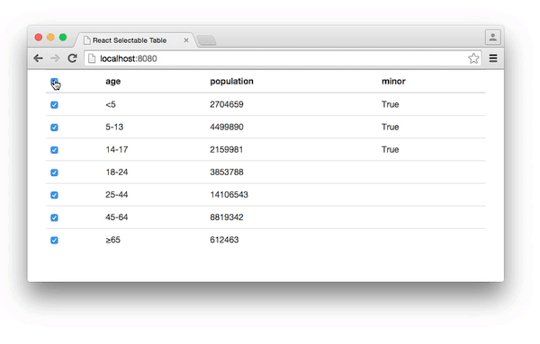

#React Selectable Table

Table component with selectable rows for Facebook's [React](https://github.com/facebook/react)

The included example (styled w/ [Bootstrap](https://github.com/twbs/bootstrap)):


##Usage
To install:
```sh
npm install --save react-table-select
```

Assuming you're using JSX:
```js
var React = require('react');
var TableSelect = require('react-table-select');

React.render(
  <TableSelect
    className="table"
    data={data}
    onChange={this.handleChange} />, document.body);
```

To access the selected rows from outside of the component save the component as a ref:
```js
<TableSelect ref="table" />

// See the onChange method for more info on selectedRows
this.refs.table.state.selectedRows
```

##API: `TableSelect` (component)

###Props
####`className` - `{String}` (optional)
Set the class on this component's child `table` element. Use this to apply styles or anything else that you need.

####`data`  - `{Array}`
An array of Objects to render as a selectable table. The table will create a column for every unique key it finds in the array. For example:
```js
this.props.data = [{one: 'fish'}, {two: 'fish'}, {red: 'fish'}, {blue: 'fish'}]
fields = [one, two, red, blue]
```

####`onChange` - `{Function}` (optional)
A callback to work with the event and selectedRows when they change:
```js
callback(event, selectedRows) {}
```
- `event` will be a React [SyntheticEvent](https://facebook.github.io/react/docs/events.html#syntheticevent)
- `selectedRows` will be an `Array` of `Int`, the indices of the currently selected rows (empty if no rows are selected). Some concrete examples:
  - No rows selected, `selectedRows` should be `[]`
  - 1st row selected, `selectedRows` should be `[0]`
  - 1st, 2nd, & 4th rows selected, `selectedRows` should be `[0, 1, 3]`

With the indices of the selected rows the selected data can be easily found using a `.map()` operation or similar.

##Example
A small example is included, to see it in action follow these steps:
```sh
git clone https://github.com/AllenSH12/react-table-select.git
cd react-table-select

npm install
gulp example

cd examples/
python -m SimpleHTTPServer # or an HTTP server of your choice

# visit localhost:8000 in your browser
```

##Testing
Tests are implemented with Facebook's [Jest](https://github.com/facebook/jest) and can be run via npm:
```sh
npm install # Only needs to be run the 1st time
npm test
```
